= Make Website (Menu)

* Go in the terminal to the location you want it to be stored

 composer create-project symfony/skeleton Menu

* Go to the file and do following commands

 composer require make

 composer req twig

* Make first Controller

 php bin/console make:controller
 (Home Controller, route set to '/')

== TEST SOME FUNCTIONALITIES

* add Bootstrap (Google search: bootstrap cdn)

image::src/images/image-2022-09-15-11-40-08-315.png[]
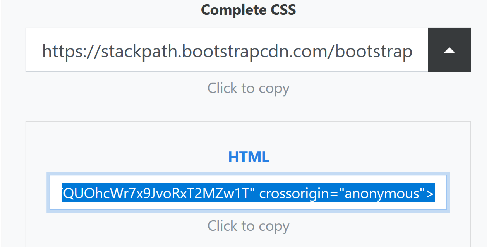

** add the line of code to the base.html.twig (template)

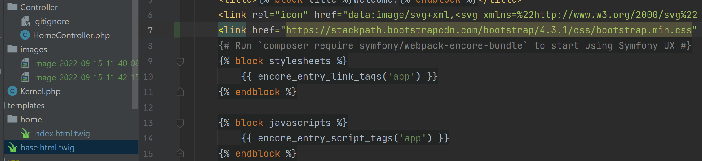

* add navigation bar (Bootstrap Navbar; copy paste the code in the body of base.html.twig)
Now I adapt the navbar:
** I rename the title of the navbar into Menu and instead of link, I will use Dishes

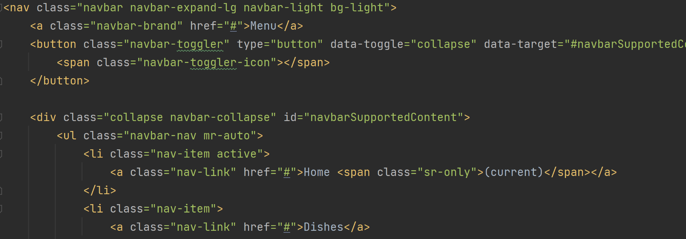

** the target link needs to be adapted also...
In the homeController you can find the route

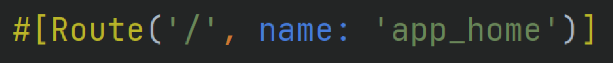

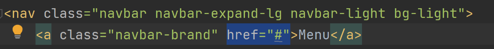

I change the route in the navbar into the route of the Homepage.
To adapt the link, I use the function 'path({{ 'nameOfRoute' }})'

To check how its works, I create a (temporary) second view (start) and link it in the navbar

== START WITH FREE TEMPLATE

Now I can get started with a free template.

* I download the website, remove all images en copy all files into the public folder of this project.

* I copy everything from the index.html and paste it into base.html.twig

* To acces the assets (CSS and images) I have to install assets by giving the command in the terminal.

 composer req asset

With this package I can specify all links of pass relative to folder public.
I adapt all the links:   <link href="{{ assets('THE LINK')}}">
and change the pass for the JavaScript files : 

** I add   between the header and the first section

I put the code from the first part into the home-template, and I adapt the ref in the navbar.

=== install doctrine and set up a database

 composer req doctrine

 php bin/console doctrine:database:create

 php bin/console make entity
 php bin/console make:migration

Then I need to check the code in the Migrationfolder and execute the command

 php bin/console doctrine:migrations:migrate

=== For maintainability and overview I create a separate controller for different pages of function or the web application.

 php bin/console make:controller

I call it DishController and create a function 'create'.
This function needs to use ManagerRegistry
To save the new dishes in the database, I need an Entity manager

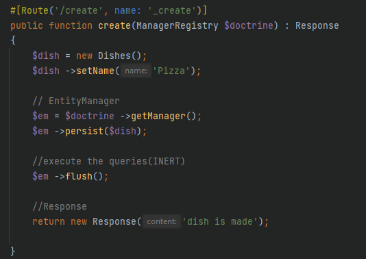

 use Doctrine\Persistence\ManagerRegistry;      !!!!

In the repository I can create queries to the entity (a few are automatically created)
This queries I can call in the controller

I adapt the index function into:

 #[Route('/', name: '_edit')]                                   // route = /dish/     name= app_dish_edit
 public function index(DishesRepository $dr): Response
 {
 $dishes = $dr->findAll();
 return $this->render('dish/index.html.twig', [
 'dish' => '$dishes',
 ]);
 }

In the index.html.twig of the dish template, I remove everything in the block body
and add a container with a table that includes the dishes

=== I ad a price to the database

 php bin/console make:entity

(from the existing table dishes)

 php bin/console doctrine:schema:update --force

=== create a form (name ends with 'type') and bound it to the entity 'Dishes'

 composer req form
 php bin/console make:form

* I adjust the create function in the dishController into

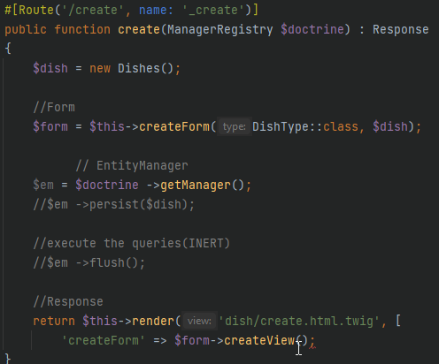

* I create a new view for dish (create.html.twig)
* add a submit button to the builder of the class DishType

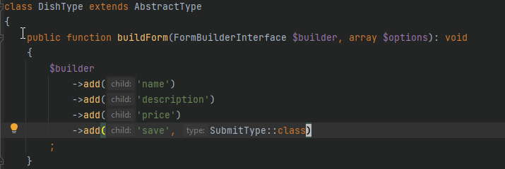

and add "form_theme: 'bootstrap_4_layout.html.twig'" into the twig.yaml, so all my form have a bootstrap lay-out.

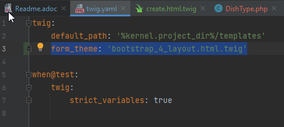

* in the controller I adjust the 'create function' so the data, created with the form, can be saved into the database
and after creating, the overview of all dishes is showed.

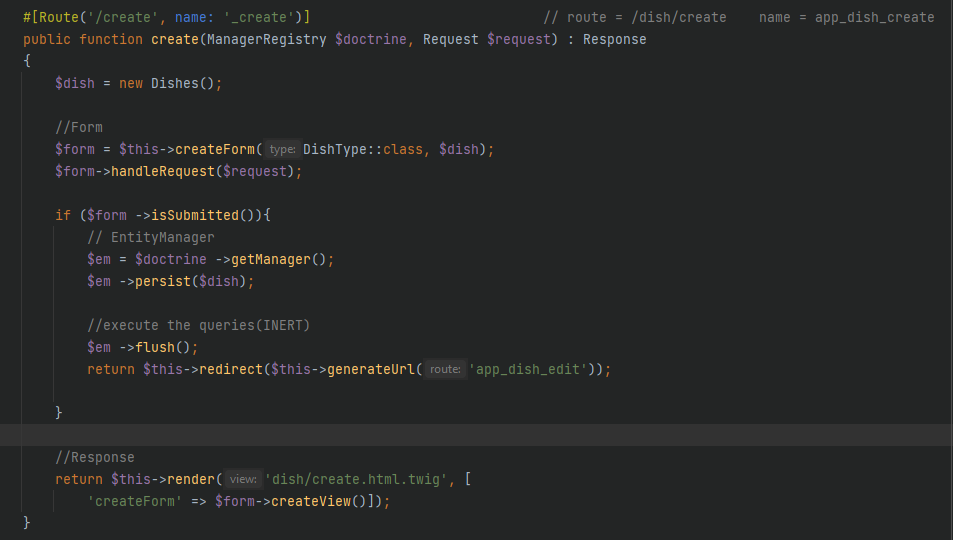

===  adapt the view of the table, so you can also create and delete a dish
* Create:

 <th><a href="{{path ('app_dish_create')}}">Create</a></th>

* Delete: therefor I first need to create a function in the controller and add a link into the view.

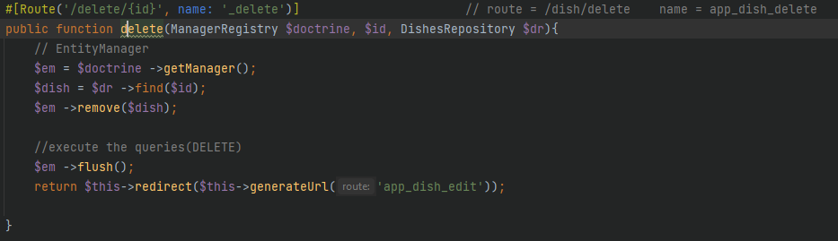

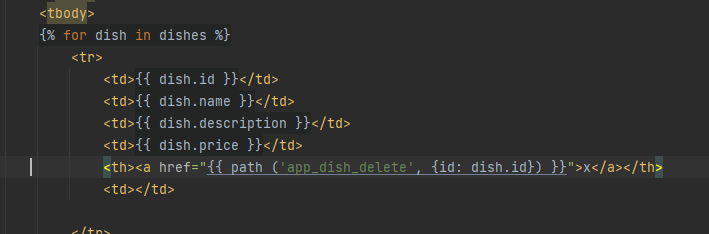

** I also add a flach message when a dish is deleted; therefor I needed to add a flach-message in the controller
and show it in the index.html.twig

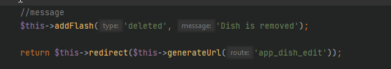

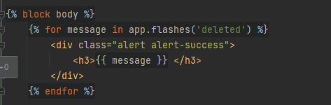

=== add pictures to the dishes,
* I download some images
* add a variable $image to the entity and create a setter and a getter:
* in the form I need to add a field that allows to select and upload images
* adapt the database:

** In controller:
*** adapt the create function, using the 'md5(uniqid()-function', to create a unique name for each picture)
*** store the uploaded images into src/images/dishes, by "move"
*** and sent it to the database

** in Service.yaml, I add

 parameters:
 images_folder: '%kernel.project_dir%/public/images/dishes'

** in the terminal. I update the database :

 composer require symfony/mime
 php bin/console doctrine:schema:update --force

Entity

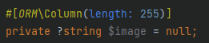

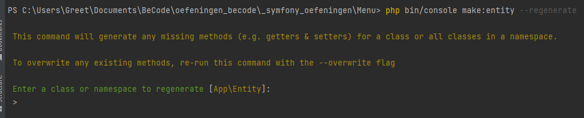

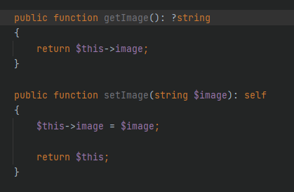

Form

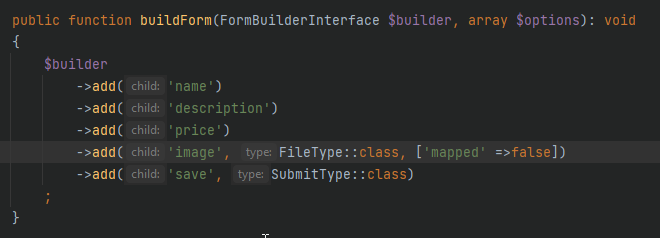

Controller

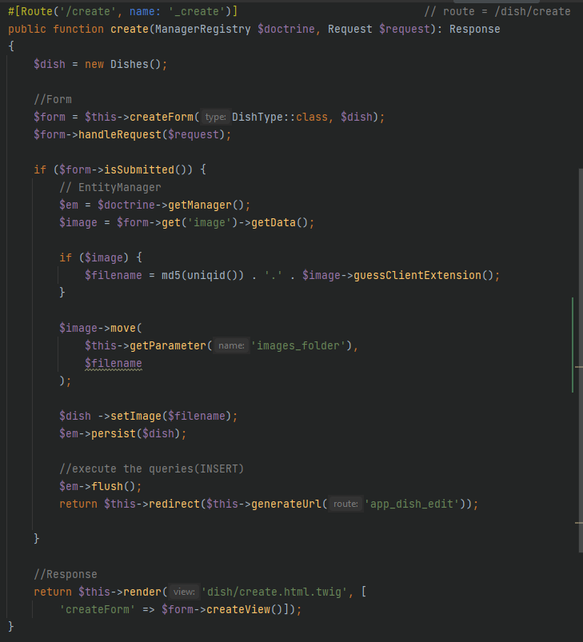

=== show the pictures of the dishes

** make a 'show-function' in the controller
** in the template (index.html.twig) I change the 'name' into a link o the picture.
As return, I render a new template (show)
** I create a new template for Dish and in the terminal, I add: "_composer req annotations_"

template:
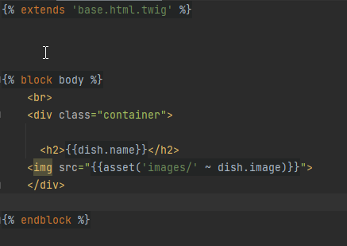

=== Divide the dishes into different categories

* I have to create more entities...

 php bin/console make:entity

* and relate the entities (by Doctrine)
** in the dish entity I create a new property (category)

 #[ORM\ManyToOne(targetEntity: "App\Entity\Category", inversedBy: "Dishes")]
    private ?string $category = null;

** and in the category entity I also create a new property (dishes)

   #[ORM\OneToMany(mappedBy: "Category", targetEntity: "App\Entity\Dishes")]
  private ?iterable $dishes = null;

** in the terminal I make a command to create the 'getters' and 'setters'

 php bin/console make:entity --regenerate

** in the entity 'Category I create a function

  public function __toString()
    {
        return $this ->name;
    }

** the Form needs to be completed

 ->add('category',EntityType::class, [
 'class' =>Category::class
 ] )

** database needs to be updated (terminal)

 php bin/console doctrine:schema:update --force

== SECURITY AND AUTHENTICATION

for security, I need a registration form and a login page

* I first require security ('composer require security')

* then I have to make u user entity: 'php bin/console make:user', witch provides security

** in the security.yaml file, the security part is created bij composer
encoders, providers, acces controle

** The entity User is created (id, username, roles and password)

(more info you can find in symfony.com/doc/current/security)

* for authentication, I can use the command: php bin/console make:auth

I choose for a login form authenticator, and call the class of the authenticator ' Custom '

In the CustomAuthenticator.php, I can decide which page is showed after login

The security Controller has a function 'login' and a function 'logout'

Composer also created new queries for the database.
I use 'php bin/console doctrine:schema:update --force ' to update the database

* I make a new controller (php bin/console make:controller RegisterController), where I add a directly add a form with a 'formBuilder'
